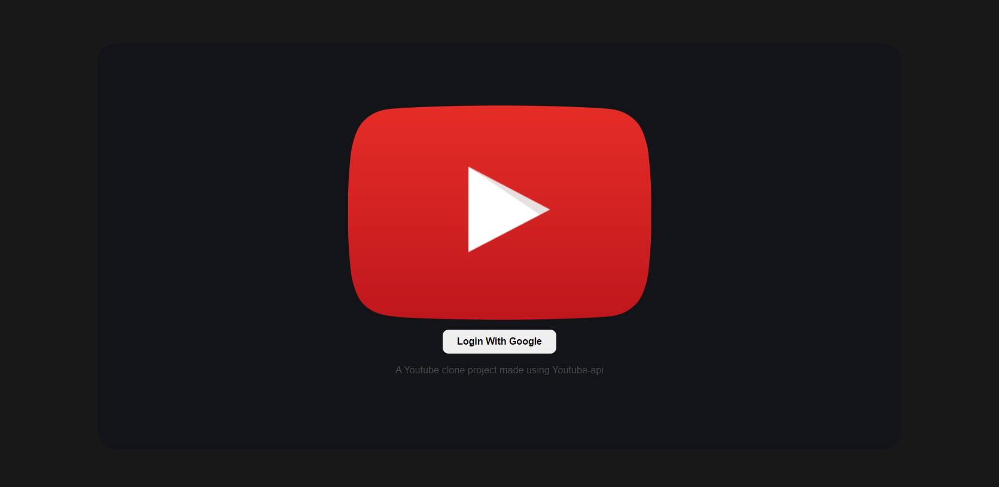
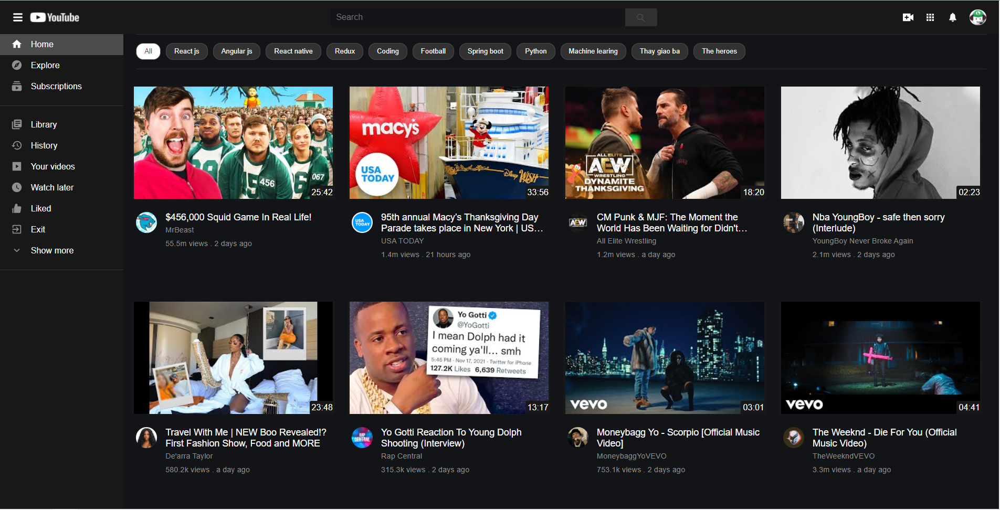
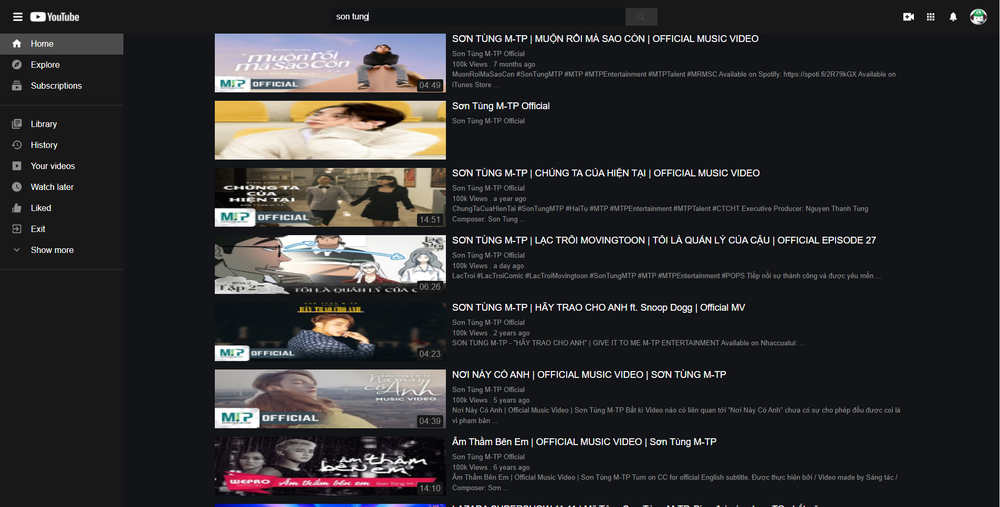
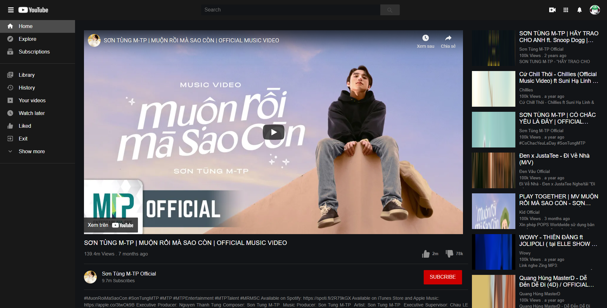

**GUIDE**

-   **Technology used**: ReactJs, Redux, Bootstrap4, SASS, FirebaseAuth, YoutubeAPI
-   **App run on**: http://localhost:3000
-   **Set up**: npm install -> npm start
-   **Layout**:
    -   Login
        
    -   Home
        
    -   Search
        
    -   Watch
        
